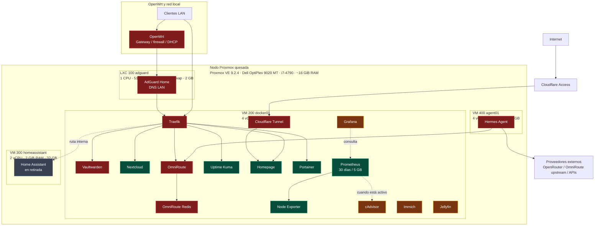

# Proxmox QuesadaLab

QuesadaLab es un homelab de infraestructura y virtualización construido sobre
Proxmox VE para operar servicios autoalojados, automatización, observabilidad y
agentes de IA.

El proyecto documenta la arquitectura, los servicios, los runbooks de operación
y los cambios necesarios para mantener el entorno reproducible.

## Objetivos

- Aprender y operar virtualización con Proxmox.
- Mantener una plataforma Docker administrada en una VM dedicada.
- Centralizar servicios internos y acceso remoto seguro.
- Operar servicios críticos con respaldos y runbooks.
- Separar servicios permanentes, bajo demanda y en retirada.
- Documentar decisiones técnicas y procedimientos de recuperación.

## Tecnologías

- Proxmox VE 9.2.4
- Debian
- Docker Engine y Docker Compose
- Traefik
- Cloudflare Tunnel
- AdGuard Home
- Vaultwarden
- Nextcloud
- OmniRoute
- Hermes Agent
- Prometheus
- Grafana
- cAdvisor
- Node Exporter
- Homepage
- Uptime Kuma
- Portainer

## Infraestructura actual

Leyenda:

- Rojo: crítico y siempre activo.
- Verde: siempre activo, no crítico.
- Amarillo: bajo demanda.
- Gris: en retirada.

Quesada-Mobile está en planificación y no se considera componente operativo.

## Inventario operativo

| Componente | Recursos / ubicación | Estado operativo |
|---|---|---|
| Proxmox `quesada` | Dell OptiPlex 9020 MT, i7-4790, ~16 GiB RAM | Crítico, siempre activo |
| LXC 100 `adguard` | 1 CPU, 512 MiB RAM, 512 MiB swap, 2 GB | Crítico, siempre activo |
| VM 200 `docker01` | 4 vCPU, 8 GiB RAM, 80 GB | Crítico, siempre activa |
| VM 400 `agent01` | 4 vCPU, 4 GiB RAM, 64 GB | Crítica, siempre activa |
| VM 300 `homeassistant` | 2 vCPU, 2 GiB RAM, 32 GB | En retirada |

## Política de servicios

Críticos y siempre activos:

- Proxmox
- `docker01`
- `agent01`
- AdGuard
- Traefik
- Vaultwarden
- Cloudflare Tunnel
- OmniRoute

Siempre activos, no críticos:

- Nextcloud
- Homepage
- Uptime Kuma
- Portainer
- Node Exporter
- Prometheus

Bajo demanda:

- Immich
- Jellyfin
- Grafana
- cAdvisor

En retirada:

- Home Assistant

## Observabilidad

Prometheus es permanente y conserva métricas históricas con:

- retención temporal: 30 días;
- retención máxima por tamaño: 5 GB;
- almacenamiento persistente en `/opt/quesadalab/data/prometheus`.

Node Exporter permanece siempre activo. Grafana y cAdvisor continúan bajo
demanda. El target de cAdvisor permanece configurado en Prometheus; cuando
cAdvisor esté apagado intencionalmente, ese target aparecerá `DOWN` y no debe
interpretarse como falla de Prometheus.

Quesada-Mobile podrá usar Prometheus para datos históricos, pero no debe
depender exclusivamente de Prometheus para estado operativo en tiempo real.

## Documentación

- [`docs/architecture/`](docs/architecture/) para topología y decisiones de alto nivel.
- [`docs/networking/`](docs/networking/) para direccionamiento y DNS.
- [`docs/services/`](docs/services/) para documentación por servicio.
- [`docs/runbooks/`](docs/runbooks/) para operación, respaldo y recuperación.
- [`adr/`](adr/) para decisiones arquitectónicas históricas.

No se deben commitear secretos, archivos `.env`, tokens, contraseñas, claves API
ni credenciales operativas.
