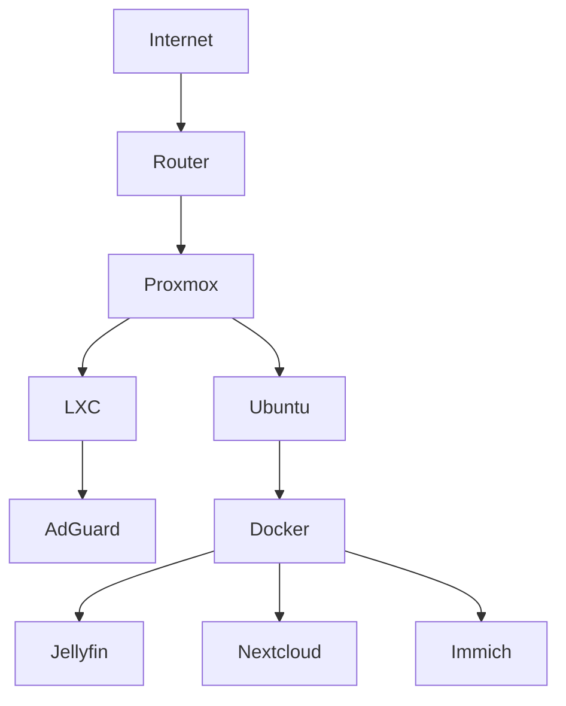

# ADR-001

## Título

Esquema de direccionamiento IP.

## Estado

Aceptado

## Contexto

La red doméstica utiliza el rango:

192.168.1.0/24

El servidor Proxmox posee la dirección:

192.168.1.10

El router distribuye direcciones mediante DHCP a partir de:

192.168.1.100

Se requiere un esquema que facilite la administración de nuevos servicios.

## Decisión

Se reservará el siguiente rango para infraestructura.

192.168.1.20-49

Docker utilizará:

192.168.1.30

AdGuard Home utilizará:

192.168.1.20

Home Assistant utilizará:

192.168.1.40

## Consecuencias

Todos los servidores utilizarán direcciones IP estáticas.

No se utilizará DHCP para servidores.

